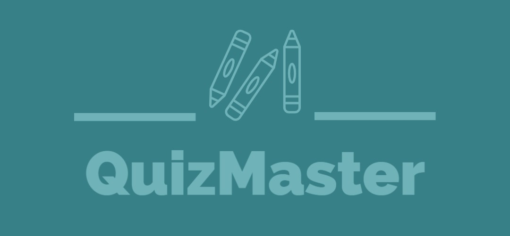

<h1 align="center">
    QuizMaster
</h1>

<p align="center">
Team Fun | Software Systems Capstone Project 
</p>

      

<center>

 

</center>

<center>

[](https://github.com/QuizMasterInc/QuizMaster/actions/workflows/prod.yml) 
[](https://github.com/QuizMasterInc/QuizMaster/actions/workflows/testing.yml)

</center>

<center>

</center>

<p align="center">
Our capstone project that allows users to take quizzes on a variety of different topics. 
</p>

## Development Team (Team Fun)
<h4>
Anthony Mastores 

[](mailto:anthonyjmastores@lewisu.edu)[](https://github.com/AnthonyMastores)
</h4>
<h4>
Maximus Lewis 

[](mailto:maximusslewis@lewisu.edu)[](https://github.com/mslew)
</h4>
<h4>
Matthew Espinos 

[](mailto:matthewwespinos@lewisu.edu)[](https://github.com/MattEspinos)
</h4>

## Installation and Setup
1. Install Firebase CLI 
```sh
npm install -g firebase-tools
```
2. Login to Firebase
```sh
firebase login
```
3. Install Dependencies
```sh
npm install
```

## Building and Running for Production
1. Running a local build
```sh
npm run dev
```

2. Running a Firebase Emulator
```sh
firebase emualators:start
```

3. Build the Project
```sh
npm run build
```

## Process
Find the process and CI/CD configuration file [here](PROCESS.md).

## Minimum Viable Product
Find our Minimum Viable Product (MVP) [here](MVP.md).

## Team
Find team information [here](TEAM.md).


